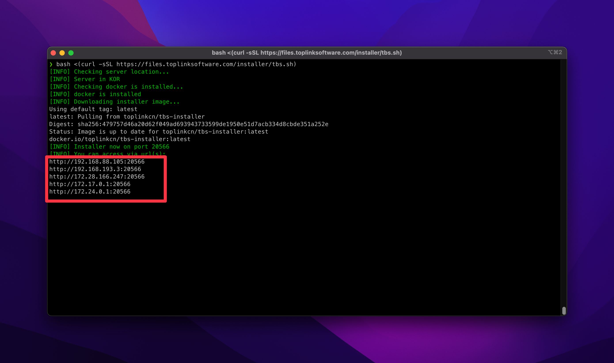

# 安装

## TL;DR

### Global
```
bash <(curl -sSL https://files.toplinksoftware.com/installer/tbs.sh)
```

### 中国大陆镜像
```
bash <(curl -sSL https://files.dcim.co/installer/tbs.sh)
```

进行完成后按照提示进入 Web 界面完成安装

## 登陆服务器
安装 TBS 财务系统时中, 您需要通过 SSH 协议登陆到您的服务器.

请参见 [选择 SSH 客户端](/docs/tech/linux/connect-to-server/choose%20ssh%20client)

## 输入安装命令

请复制以下命令到您的服务器命令界面中, 并执行

### 被安装的服务器在中国
请使用以下命令
```
bash <(curl -sSL https://files.dcim.co/installer/tbs.sh)
```

### 被安装的服务器不在中国
请使用以下命令
```
bash <(curl -sSL https://files.toplinksoftware.com/installer/tbs.sh)
```

如安装过程中, 出现的问题可在 [执行安装命令出现问题](#执行安装命令出现问题) 的说明中找到

## 安装过程

### 安装器启动

命令安装过程中, 将会检测 `Docker` 运行环境. 如不存在, 将会提示您是否安装 `Docker` 运行环境

输入 `y` 进行自动安装


图为 `Docker` 运行环境安装过程


### 获取安装器访问地址

安装器下载完成后, 将输出一些 URL 地址, 您可根据服务器环境选择可用的安装 URL 地址进行访问



### 访问安装器

访问安装器 URL 后, 您将会来到一个友好的 Web 界面. 该界面将会引导您一步步的完成 TBS 系统的安装


点击 `[下一步]` 按钮, 以便进行下一步


### 下载安装镜像

进入 `[下载产品]` 步骤后, 将会开始自动下载必选的软件镜像.

图中为 `软件镜像获取`


图中为 `软件镜像下载`


图中为 `软件镜像解压`


### 产品安装配置

在本步骤中, 您将需要填写软件的安装位置. 以及 Web 服务器的运行代号

安装位置需填写 Linux 系统中的绝对位置, 可参见 [Linux 目录结构](/docs/tech/linux/file-and-folder/structure)

安装代号不能与系统中其他 TBS 实例的 Nginx 代号重复


图中为完成填写配置的示例


点击 `[下一步]` 按钮, 以便进行下一步安装配置


## 执行安装命令出现问题

### bash: curl: command not found

该提示为操作系统中没有安装 `curl` 软件, 请使用包管理器进行安装即可 (包管理器: apt / dnf / yum)

Redhat/CentOS/Almalinux/RockyLinux 可使用以下命令安装
```
yum install curl -y
```

Debian/Ubuntu 可使用以下命令安装
```
apt update && apt install curl -y
```

### curl: (60) The certificate issuer's certificate has expired

该提示为操作系统中没有更新 `ca-certificates` 软件, 请使用包管理器进行更新即可 (包管理器: apt / dnf / yum)

Redhat/CentOS/Almalinux/RockyLinux 可使用以下命令安装
```
yum upgrade ca-certificates -y
```

Debian/Ubuntu 可使用以下命令安装
```
apt update && apt upgrade ca-certificates -y
```